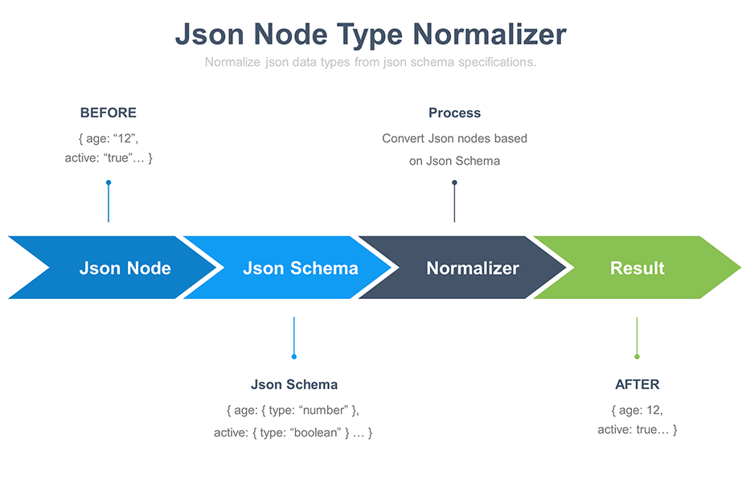

# Json-Node-Normalizer
NodeJS module that normalize json data types from json schema specifications.

[](https://www.npmjs.com/package/json-node-normalizer)
[](https://circleci.com/gh/benjamin-allion/json-node-normalizer/tree/master)
[](https://app.codacy.com/app/benjamin-allion/json-node-normalizer?utm_source=github.com&utm_medium=referral&utm_content=benjamin-allion/json-node-normalizer&utm_campaign=Badge_Grade_Dashboard)
[](https://www.codacy.com/app/benjamin-allion/json-node-normalizer?utm_source=github.com&utm_medium=referral&utm_content=benjamin-allion/json-node-normalizer&utm_campaign=Badge_Coverage)
[](https://standardjs.com)
[](https://nodejs.org/en/download/)
[]()
[](https://raw.githubusercontent.com/bojand/json-schema-deref/master/LICENSE)



## Features

* Convert / Cast Json Node type to another type :
    * From Json Schema Specifications
    * From Json Path
* Supported types :
    * `string`
    * `number`, `integer`
    * `array`
    * `boolean`
* Json Schema $Ref / Definitions support    

## Installation

Add the latest version of `json-node-normalizer` to your package.json:

```sh
npm install json-node-normalizer --save
```

## Node.js Usage

```javascript
const JsonNodeNormalizer = require('json-node-normalizer');
const normalizedJson = await JsonNodeNormalizer.normalize(jsonData, jsonSchema);
```

## Use case
    
We have a json object with incorrect type formats :

```javascript
const jsonData = {
   "fields":{
      "id": 123, // Must be a string
      "name":"my_name",
      "firstName":"firstName",
      "age": "31", // Must be a number
      "phone": "33600000010", // Must be a number
      "orders":{ // Must be an array
         "label": "first_order"
      },
      "active": "true" // Must be a boolean
   }
}
```

We want to normalize json object to match with a Json Schema :
```javascript
const jsonSchema = {
   "fields":{
      "type":"object",
      "properties":{
         "id":{
            "type":"string"
         },
         "name":{
            "type":"string"
         },
         "firstName":{
            "type":"string"
         },
         "age":{
            "type":"number"
         },
         "phone":{
            "type":"integer"
         },
         "orders":{
            "type":"array",
            "items":{
               "label":{
                  "type":"string"
               }
            }
         },
         "active":{
            "type":"boolean"
         }
      }
   }
}
```
We can use JsonNodeNormalizer to normalize our json data :

```javascript
const JsonNodeNormalizer = require('json-node-normalizer');
const result = await JsonNodeNormalizer.normalize(jsonData, jsonSchema);
```
Result :
```javascript
result = {
   "fields":{
      "id": 123,
      "name": "my_name",
      "firstName": "firstName",
      "age": 31,
      "phone": 33600000010,
      "orders":[{
         "label": "first_order"
      }],
      "active": true
   }
}
```

## Normalize node(s) from path (Without Json-Schema)

You can also use `normalizePath` method if you do not want to use the schema json.

```javascript
const { JsonNodeNormalizer, NodeTypes } = require('json-node-normalizer');
let normalizedJson = JsonNodeNormalizer.normalizePath(jsonData, '.fields.id', NodeTypes.NUMBER_TYPE);
normalizedJson = JsonNodeNormalizer.normalizePath(jsonData, '.fields.orders', NodeTypes.ARRAY_TYPE);
normalizedJson = JsonNodeNormalizer.normalizePath(jsonData, '.fields.orders[*].label', NodeTypes.STRING_TYPE);

// You can also normalize each element with name 'active' for example...
normalizedJson = JsonNodeNormalizer.normalizePath(jsonData, '..active', NodeTypes.BOOLEAN_TYPE);
```

## JsonPath Documentation

See https://github.com/json-path/JsonPath for more information about JsonPath expressions.

## Logging Level

Log events can have different severity levels - in some cases, you just want to log events with at least a warning level, sometimes log lines have to be more verbose.

Each level is given a specific integer priority. The higher the priority the more important the message is considered to be.

| Level 	| Priority 	|
|-------	|----------	|
| debug 	| 4        	|
| info (default) 	| 2        	|
| error 	| 0        	|

By default the logging level is set to 'info'.

You can override the logging level by setting the `JSON_NODE_NORMALIZER_LOGGING_LEVEL` environment variable.

## License

[MIT License](http://www.opensource.org/licenses/mit-license.php).
